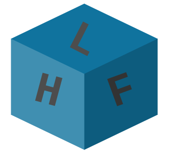

#  


## Test network deployment

1. Clone the `hyperledger/fabric-samples` and install the binaries needed
```sh
curl -sSL https://bit.ly/2ysbOFE | bash -s
```

2. Create the network
```sh
./network.sh up
```

2. Create a channel
```sh
./network.sh createChannel
```

3. Package the smart contract

    - Send imported packages in the `vendor` folder. `GO111MODULE=on go mod vendor`.

4. Use the peer CLI 
    - Add the binaries in our PATH `export PATH=${PWD}/../bin:$PATH`
    - `export FABRIC_CFG_PATH=$PWD/../config/`
    - Create the chaincode packahe `peer lifecycle chaincode package basic.tar.gz --path ../asset-transfer-basic/chaincode-go/ --lang golang --label basic_1.0`
    This command will create a package named basic.tar.gz in your current directory. The --lang flag is used to specify the chaincode language and the --path flag provides the location of your smart contract code. The path must be a fully qualified path or a path relative to your present working directory. The --label flag is used to specify a chaincode label that will identity your chaincode after it is installed. It is recommended that your label include the chaincode name and version.

5. Install the chaincode package to the peers

Peer0/Org1
```sh
export CORE_PEER_TLS_ENABLED=true
export CORE_PEER_LOCALMSPID="Org1MSP"
export CORE_PEER_TLS_ROOTCERT_FILE=${PWD}/organizations/peerOrganizations/org1.example.com/peers/peer0.org1.example.com/tls/ca.crt
export CORE_PEER_MSPCONFIGPATH=${PWD}/organizations/peerOrganizations/org1.example.com/users/Admin@org1.example.com/msp
export CORE_PEER_ADDRESS=localhost:7051
```

```sh
peer lifecycle chaincode install basic.tar.gz
```

Peer0/Org2
```sh
export CORE_PEER_LOCALMSPID="Org2MSP"
export CORE_PEER_TLS_ROOTCERT_FILE=${PWD}/organizations/peerOrganizations/org2.example.com/peers/peer0.org2.example.com/tls/ca.crt
export CORE_PEER_TLS_ROOTCERT_FILE=${PWD}/organizations/peerOrganizations/org2.example.com/peers/peer0.org2.example.com/tls/ca.crt
export CORE_PEER_MSPCONFIGPATH=${PWD}/organizations/peerOrganizations/org2.example.com/users/Admin@org2.example.com/msp
export CORE_PEER_ADDRESS=localhost:9051
```

```sh
peer lifecycle chaincode install basic.tar.gz
```

## Fabcar example
In the `hyperldger/fabric-samples/fabcar` folder, there are:
- Scripts to setup a network 
- Instructions to run the chaincode in `hyperledger/fabric-samples/chaincodes/fabcar`
- Insructions to test the chaincode running some Invoking operations from `hyperledger/fabric-samples/fabcar/`